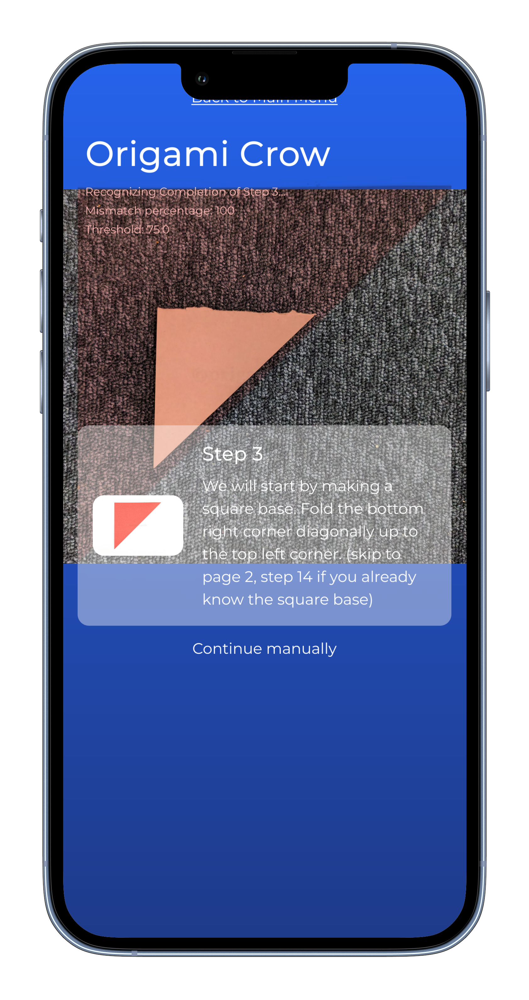

  
  
  
  
  

 

  
  <h3 align="center">SnapOrigami - AR Origami Guide</h3>
  
Bring interactive, step-by-step origami guidance directly into your camera view.

  
  

## How to use

1. Either load up my [demo frontend instance](https://snaporigami.landmann.ph/) or [set up your own](https://github.com/Kuuhhl/snapOrigami/tree/main/frontend).
2. Find a backend instance or [set up your own](https://github.com/Kuuhhl/snapOrigami/tree/main/backend).
3. Tap on any of the origami creatures to open the instructions.
4. Set your Backend URL using the button on the bottom of the page.

## Screenshots

  
  

## What does it do?

SnapOrigami serves as a helpful companion in your origami learning journey, providing real-time guidance and error detection.

By recognizing your current step in the origami folding process, it automatically progresses to the next one upon successful completion. 

This interactive approach not only prevents incorrect folds but also enhances the learning experience by providing immediate feedback.

## Credits

* The Origami Instructions are originally from [https://origami.guide/](https://origami.guide/).

## Contributors

