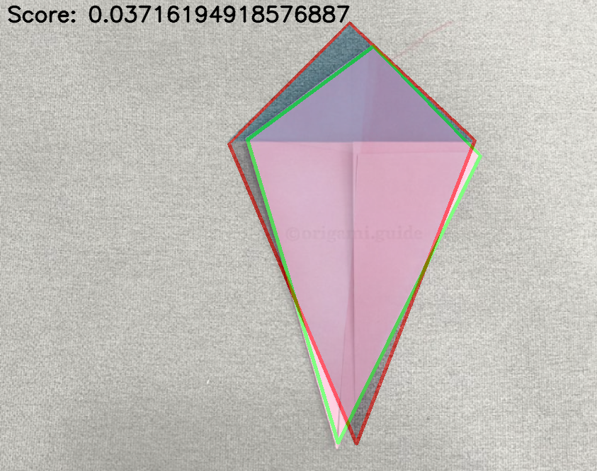

<div align="center">
    
    
    
</div>

<br />

<p align="center">
  
  <h3 align="center">SnapOrigami - Backend</h3>
  <p align="center">Backend of SnapOrigami.</p>
</p>



*Visualization of Contour Shape Comparison*

## Purpose

The Backend is responsible for running the step recognition part of the Web App.
It tries to find the contour of the paper, comparing it to the reference contour.
The final similarity score is sent to the frontend, so that it can go to the next stage when
the user finished their step.


## Deploying via Docker

1. Make sure Docker is installed on your system.
2. Navigate to this directory.
3. Build the Docker-Image with `docker build -t snaporigami-backend ./`
4. Run the Docker-Container with `docker run -p 5000:5000 snaporigami-backend`. This will deploy the backend server to listen on `localhost:5000`.

## Running manually

1. Make sure you have Python 3 installed.
2. Install the requirements: `pip install -r requirements.txt`.
3. Start the Server: `python app.py`.
4. The Server should now be running on `localhost:5000`.

## Endpoints

### `/ping` 

**Method:** GET  
**Response:** 

```json
{
  "message": "pong"
}
```

**Status Code:** 200

### `/compareImages`

**Method:** POST
**Request Body:** A JSON with keys image1 and image2 containing images as base64 strings.
**Response:** A similarity score or an error if something went wrong.
**Possible Errors:**

* "Image 1 or 2 not given"
* "One of the images did not have a clear contour"
