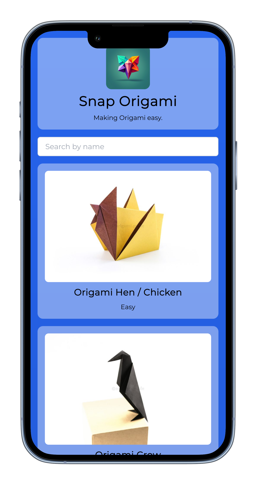
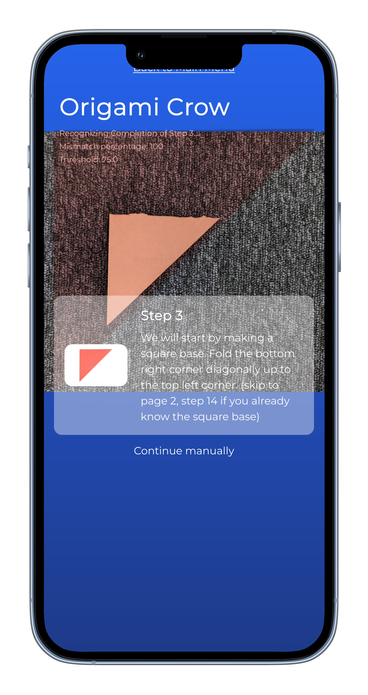

  

 

  
  <h3 align="center">SnapOrigami - AR Origami Guide</h3>
  
An app that guides the user through making origami.

  

## Screenshots

  
  

## Developing

1. Clone the repository
2. Install project dependencies with `npm install`
3. Run the development server using `npm start`
4. The Web-App should be available on `localhost:3000`

## Contributors

